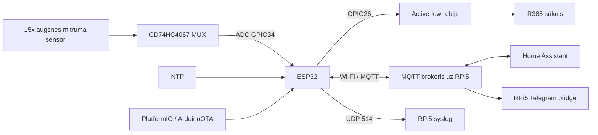

# Arhitektūra

## Atbildību sadalījums

### ESP32
- lasa 15 sensorus caur MUX;
- filtrē acīmredzami nestabilus ADC lasījumus;
- publicē mitruma kategorijas MQTT;
- pieņem sūkņa komandas;
- uztur lokālo sūkņa taimeri un absolūto 180 s drošības limitu;
- nodrošina HA MQTT discovery;
- nosūta logus MQTT un syslog;
- atbalsta OTA.

### RPi5 / Home Assistant
- MQTT brokeris ir integrācijas mugurkauls;
- Home Assistant saņem discovery entītijas;
- Telegram paziņojumi/komandas vēsturiski tika pārvietoti uz RPi5, nevis turēti ESP32 TLS klientā.

## Source-of-truth robeža

`src/main.cpp` ir pašreizējais zināmais firmware avots. RPi5 skriptu vēsturiskās kopijas nav automātiski uzskatāmas par aktuālām; tās jāsalīdzina ar dzīvo RPi5 pirms importēšanas.
