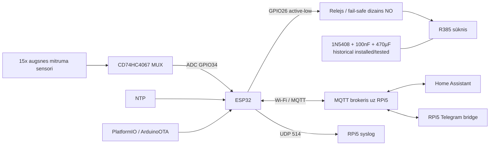

# Arhitektūra

## Atbildību sadalījums

### ESP32

- lasa 15 sensorus caur MUX;
- filtrē/vidējo ADC lasījumus un klasificē mitrumu;
- publicē mitruma kategorijas MQTT;
- pieņem sūkņa komandas;
- uztur lokālo sūkņa taimeri un absolūto 180 s drošības limitu;
- piespiež releju OFF boot un OTA sākumā;
- nodrošina HA MQTT discovery;
- nosūta logus MQTT un syslog;
- atbalsta authenticated ArduinoOTA;
- uztur watchdog un Wi-Fi/MQTT reconnect neatkarīgi no Telegram bridge.

### RPi5 / Home Assistant

- MQTT brokeris ir integrācijas mugurkauls;
- Home Assistant saņem discovery entītijas un var sūtīt pump ON/OFF;
- Telegram komandas/paziņojumi tika pārvietoti uz RPi5, nevis turēti ESP32 TLS klientā;
- vēsturiski uz RPi5 bija `balkons-bot.service`, `balkons-log.service` un `laistisana.sh` tipa HA REST vadības skripts;
- Telegram/HA slānis ir **papildu vadība**, nevis vienīgais sūkņa OFF drošības mehānisms.

## Kāpēc Telegram tika iznests no ESP32

Agrīnā versijā ESP32 vienlaikus kontrolēja aparatūru un turēja ārēju TLS savienojumu uz Telegram. Vēsturē bija heap/TLS/savienojumu nestabilitātes un atsevišķs `balkons-bot.service` crash periods pēc migrācijas uz RPi5.

Tāpēc projektā saglabāts princips:

> ārējas chat/API problēmas nedrīkst ietekmēt lokālo sūkņa hard-limit un fail-safe OFF.

## Sūkņa elektriskā robeža

Vēsturē bija ESP32 restarti tieši sūkņa izslēgšanas brīdī. Atgūtais labojums ir `1N5408` flyback diode un `100nF + 470µF` decoupling/bulk aizsardzība. Ir atgūts vismaz viens ~15 s post-fix sūkņa cikls bez ESP32 pazušanas.

Releja pareizais fail-safe dizains ir NO. Precīzais pašreizējais `COM/NO/NC` termināļu vadojums joprojām jānofotografē kā fizisks pierādījums.

## Source-of-truth robeža

`src/main.cpp` ir pašreizējais firmware avots. RPi5 skriptu vēsturiskās kopijas nav automātiski uzskatāmas par aktuālām; tās jāsalīdzina ar dzīvo RPi5 pirms importēšanas.

Vēsturisko faktu/conflict source-of-truth ir [`HISTORICAL_KNOWLEDGE_BASE.md`](HISTORICAL_KNOWLEDGE_BASE.md).